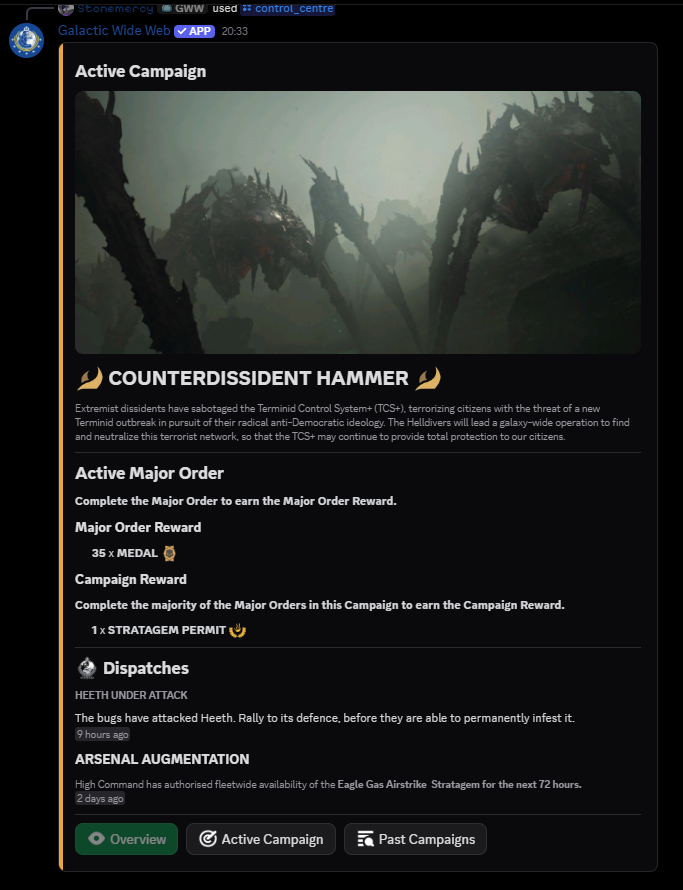
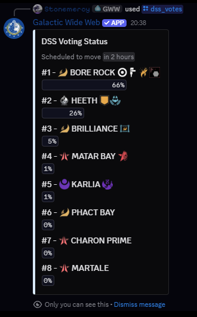
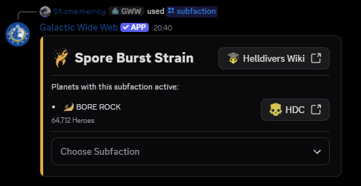
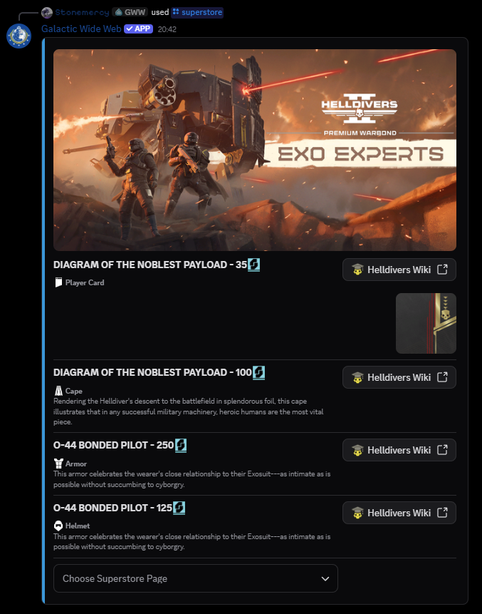
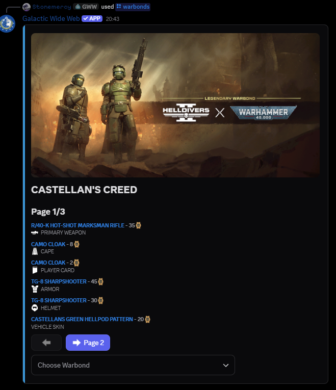

  

<h1 align="center">Galactic Wide Web: Fluxer Port</h1>

    
	
	
   
  
	
  
  
   
  

  Galactic Wide Web: Fluxer Port is a Fluxer bot for Helldivers 2 that provides real-time information on the Galactic War.
   
  Disclaimer: This is a fork of the original Galactic Wide Web bot by StoneMercy. It is not feature complete and bugs are to be expected and reliability is not guaranteed. You have been warned!
   
  It pulls live data from the official Helldivers 2 API and the Steam API, and keeps an auto-updating dashboard refreshed every 15 minutes with a strategic overview of the current war effort.  
  The bot includes commands, and embedded content. All interactions take place in text channels.
   
  Server administrators (or those with Manage Server permissions) can configure which channels are used for dashboards and announcements.
   
  The bot has a variety of Helldivers 2 data, including:

    - Personal Orders - <b>EXCLUSIVE!</b> - UNAVAILABLE on the Fluxer port due to private API usage 
    - DSS Vote counts - <b>EXCLUSIVE!</b> - UNAVAILABLE on the Fluxer port due to private API usage 
    - Major Orders 
    - Control Centre (campaigns) - NYI on the Fluxer port 
    - Superstore - UNAVAILABLE on the Fluxer port due to private API usage 
    - Warbonds - UNAVAILABLE on the Fluxer port due to private API usage 
    - Dispatches 
    - Global Events 
    - DSS movements and Tactical Action updates 
    - Planetary Region changes 
    - Campaign wins and losses 
    - and Steam patch notes. 
     
    The bot also supports multilingual output, currently offering English, French, German, Italian, Portuguese (BR),
     
  Built using a butchered version of Disnake (ported to Fluxer), it stores settings in PostgreSQL and uses Pillow and opencv to generate maps.

## Quick Navigation
- [Inviting the Bot](#inviting-the-galactic-wide-web)
- [Examples](#examples) (to be updated)

| Here are the bots commands |   |   |
|---|---|---|
| [`/check_missing_translations`](#check_missing_translations-language_to_check-fr) | [`/community_servers`](#community_servers) | [`/control_centre`](#control_centre) |
| [`/dispatches`](#dispatches) | [`/dss`](#dss) | [`/dss_votes`](#dss_votes) |
| [`/global_events`](#global_events) | [`/major_order`](#major_order) | [`/map`](#map) |
| [`/personal_order`](#personal_order) | [`/planet`](#planet-planet-124-bore-rock) | [`/setup`](#setup) |
| [`/steam`](#steam) | [`/subfaction`](#subfaction) | [`/superstore`](#superstore) |
| [`/warbonds`](#warbonds) | [`/warfront`](#warfront-faction-automaton) | |

- [Support](#support)
- [Contributing](#contributing)

## Inviting the Galactic Wide Web
Want to try out the GWW on your server? [Invite Link](https://web.fluxer.app/oauth2/authorize?client_id=1476519709822349355&scope=bot)

## Examples
### `/check_missing_translations language_to_check: fr`

<a href="#top">Back to Top ↑</a>

### `/community_servers`

<a href="#top">Back to Top ↑</a>

### `/control_centre`

<a href="#top">Back to Top ↑</a>

### `/dispatches`

<a href="#top">Back to Top ↑</a>

### `/dss`

<a href="#top">Back to Top ↑</a>

### `/dss_votes`

<a href="#top">Back to Top ↑</a>

### `/global_events`

<a href="#top">Back to Top ↑</a>

### `/help command: check_missing_translations`

<a href="#top">Back to Top ↑</a>

### `/major_order`

<a href="#top">Back to Top ↑</a>

### `/map`

<a href="#top">Back to Top ↑</a>

### `/personal_order`

<a href="#top">Back to Top ↑</a>

### `/planet planet: 124-BORE ROCK`

<a href="#top">Back to Top ↑</a>

### `/setup`

<a href="#top">Back to Top ↑</a>

### `/steam`

<a href="#top">Back to Top ↑</a>

### `/subfaction`

<a href="#top">Back to Top ↑</a>

### `/superstore`

<a href="#top">Back to Top ↑</a>

### `/warbonds`

<a href="#top">Back to Top ↑</a>

### `/warfront faction: Automaton`

<a href="#top">Back to Top ↑</a>

## Support
Available here: [Fluxer Support Server](https://fluxer.gg/m50i6kcZ)

<a href="#top">Back to Top ↑</a>

## Contributing
Contributions are welcome!

To contribute to localization (upstream only):
1. Open an issue with the Language Request template
2. Create a pull request and add a .json file to the [data/languages/](https://github.com/Stonemercy/Galactic-Wide-Web/tree/main/data/languages) folder

or just head to the Fluxer Support Server above

<a href="#top">Back to Top ↑</a>

